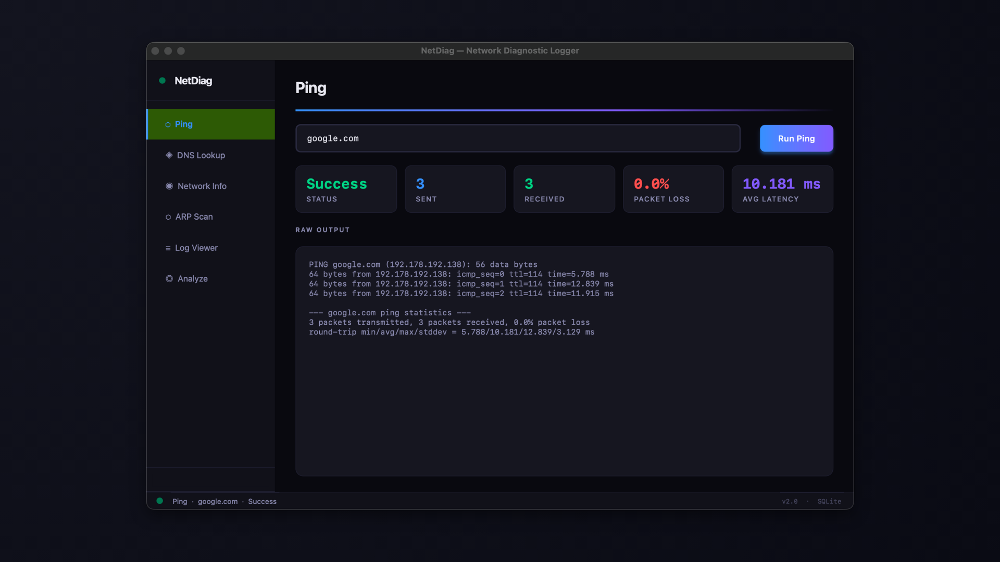
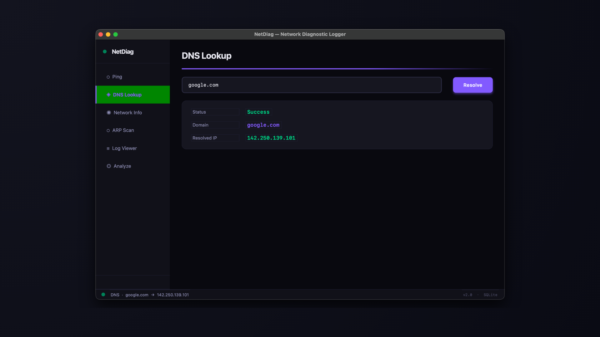
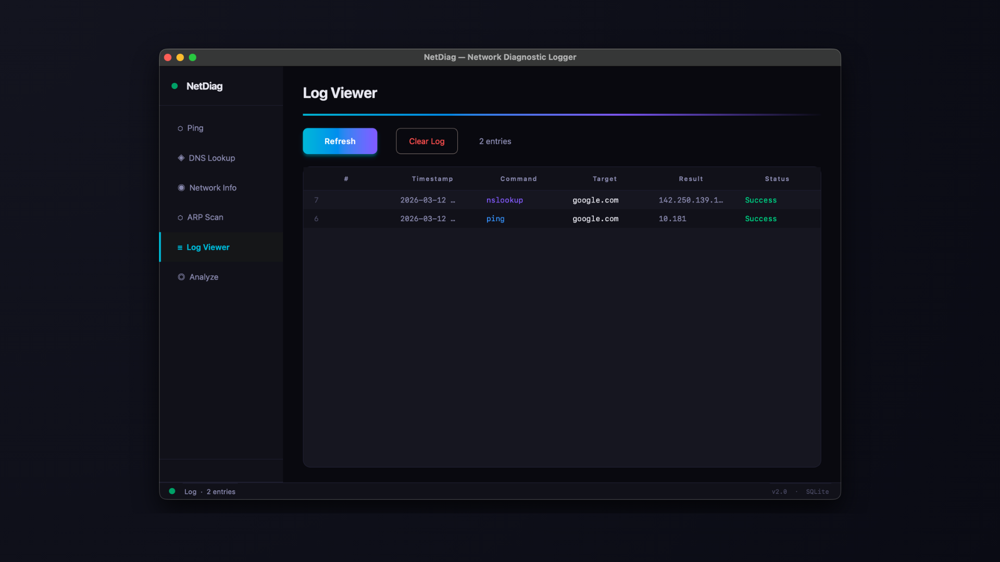
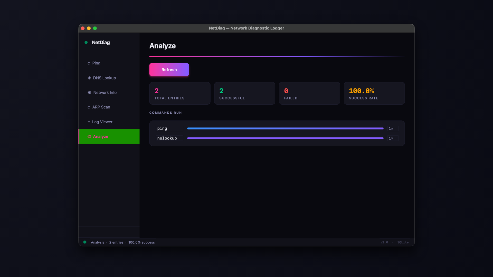

# NetDiag — Network Diagnostic Logger

A macOS network diagnostic tool built with Python and PyQt6, backed by SQLite. Run pings, resolve DNS, inspect your network interface, scan ARP tables, scan ports, and keep a persistent log of every operation — all from a clean dark-mode GUI.

---

## Features

- **Ping** — send ICMP requests and view latency stats (sent, received, packet loss, avg ms)
- **DNS Lookup** — resolve any domain to its IP address
- **Network Info** — inspect your MAC address, IP, and interface details
- **ARP Scan** — discover devices on your local network
- **Port Scanner** — scan all 65535 ports on any host or IP, identify open ports and known services
- **Log Viewer** — every command is persisted to SQLite with timestamp, target, result, and status
- **Analyze** — usage breakdown of all commands run, success rate at a glance

---

## Screenshots

<p align="center">
  
  
</p>
<p align="center">
  
  
</p>

---

## macOS First Launch

macOS may block NetDiag on first launch since the app is not notarized. To open it:

1. Try to open **NetDiag** — macOS will show a security warning
2. Go to **System Settings → Privacy & Security**
3. Scroll down to the blocked app and click **"Open Anyway"**
4. Confirm by clicking **Open** in the dialog

This only needs to be done once.

---

## Downloads

Pre-built macOS binaries are available on the [Releases](https://github.com/berhanerdogan/netdiag/releases) page.

| Platform | Download | Notes |
|---|---|---|
| macOS | `.dmg` | Mount and drag to Applications |
| macOS | `.zip` | Extract and drag to Applications |
| Windows | Coming soon | — |

No Python installation required for pre-built binaries.

---

## Build from Source

**Requirements**
- Python 3.10+
- macOS (Windows support coming)

**Clone and run**
```zsh
git clone https://github.com/berhanerdogan/netdiag.git
cd netdiag
pip install -r requirements.txt
python main.py
```

**Build macOS app with py2app**
```zsh
pip install -r requirements.txt
python setup.py py2app
# Output: dist/NetDiag.app
```

**Build macOS app with PyInstaller**
```bash
pip install -r requirements.txt
pyinstaller --windowed --name NetDiag main.py
```

---

## Requirements

```
altgraph==0.17.5
macholib==1.16.4
packaging==26.0
py2app==0.28.10
PyQt6==6.10.2
PyQt6-Qt6==6.10.2
PyQt6_sip==13.11.1
setuptools==82.0.1
```

---

## Tech Stack

- **Python 3.14**
- **PyQt6** — GUI framework
- **SQLite** — persistent log storage (stdlib, no external DB)

---

## License

MIT